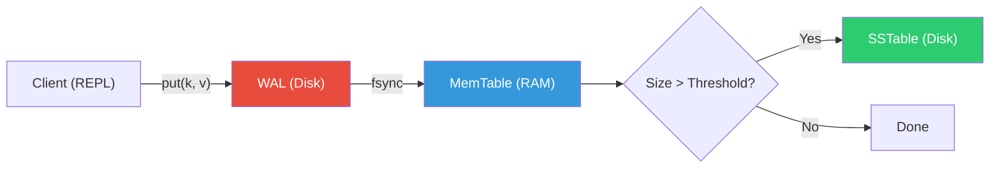
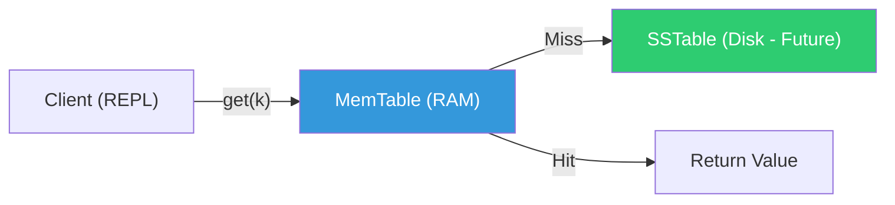

# OBLIVION - Architecture

## LSM-Tree Overview

OBLIVION implements a simplified Log-Structured Merge Tree (LSM-Tree) storage engine.

### Write Path



### Read Path



### Recovery Path


## Component Map

| Component    | File                 | Responsibility                |
| ------------ | -------------------- | ----------------------------- |
| **MemTable** | `engine/memtable.rs` | In-memory sorted BTreeMap     |
| **WAL**      | `engine/wal.rs`      | Append-only durability log    |
| **SSTable**  | `engine/sstable.rs`  | Immutable disk storage (stub) |
| **Engine**   | `engine/mod.rs`      | Coordinator (put/get/flush)   |
| **CLI**      | `main.rs`            | Interactive REPL interface    |

## Binary WAL Format

Each WAL entry uses a compact binary format:

```
┌─────────┬──────────┬─────┬──────────┬───────┬──────┐
│ OpType  │ Key Len  │ Key │ Val Len  │ Value │ CRC  │
│ 1 byte  │ 4 bytes  │ N   │ 4 bytes  │ M     │ 4 b  │
│         │ (LE u32) │     │ (LE u32) │       │      │
└─────────┴──────────┴─────┴──────────┴───────┴──────┘
```

**OpType**: `0x01` = Put, `0x02` = Delete
**CRC**: CRC32 over all preceding bytes in the entry

## Design Decisions

1. **BTreeMap for MemTable**: Provides O(log n) sorted access, enabling efficient range scans.
2. **CRC32 checksums**: Detects data corruption in the WAL during recovery.
3. **BufWriter**: Reduces syscall overhead by batching small writes.
4. **Tombstones**: Deletions are represented as `None` values, allowing correct shadowing in LSM merges.
5. **fsync after writes**: Ensures durability at the cost of write latency.
