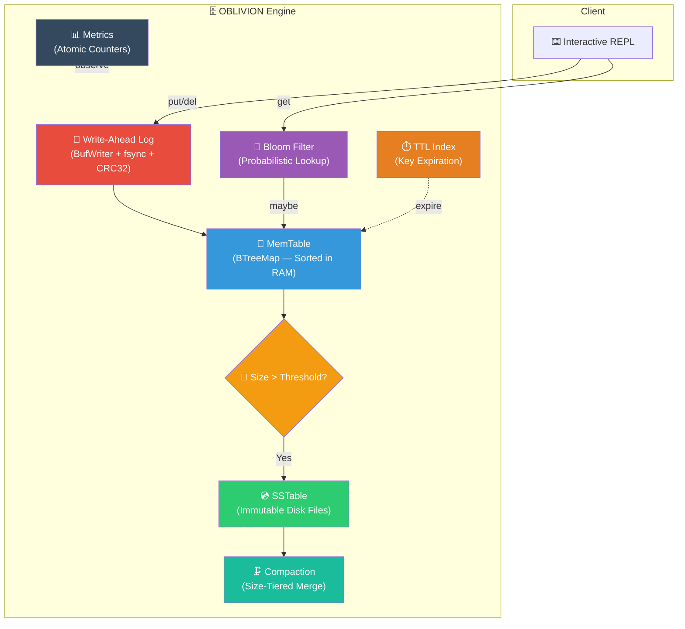

<div align="center">

```
   ██████╗ ██████╗ ██╗     ██╗██╗   ██╗██╗ ██████╗ ███╗   ██╗
  ██╔═══██╗██╔══██╗██║     ██║██║   ██║██║██╔═══██╗████╗  ██║
  ██║   ██║██████╔╝██║     ██║██║   ██║██║██║   ██║██╔██╗ ██║
  ██║   ██║██╔══██╗██║     ██║╚██╗ ██╔╝██║██║   ██║██║╚██╗██║
  ╚██████╔╝██████╔╝███████╗██║ ╚████╔╝ ██║╚██████╔╝██║ ╚████║
   ╚═════╝ ╚═════╝ ╚══════╝╚═╝  ╚═══╝  ╚═╝ ╚═════╝ ╚═╝  ╚═══╝
```

### 🗄️ System 13/300 — LSM-Tree Key-Value Storage Engine

[](https://github.com/DaviBonetto/OBLIVION-L3-LSM-Storage-Engine/actions/workflows/ci.yml)
[](https://www.rust-lang.org/)
[](LICENSE)
[](#-testing)

A **production-grade LSM-Tree storage engine** built from scratch in Rust.  
Crash-recoverable, WAL-durable, with Bloom Filters, TTL expiration, and thread-safe concurrency.

---

[Quick Start](#-quick-start) · [Architecture](#-architecture) · [Features](#-features) · [Usage](#-usage) · [Testing](#-testing)

</div>

---

## 📖 What is OBLIVION?

OBLIVION is a **Log-Structured Merge-Tree (LSM-Tree) key-value storage engine** — the same architecture that powers databases like LevelDB, RocksDB, and Apache Cassandra.

It implements the full LSM write path: writes go to a **Write-Ahead Log (WAL)** for durability, then to an in-memory **MemTable** (sorted BTreeMap), and finally flush to immutable **SSTables** on disk when the memory threshold is reached.

**What makes it interesting:**

- 🔒 **Crash Recovery** — WAL replay with CRC32 integrity verification
- ⚡ **Bloom Filter** — O(1) probabilistic lookups to skip unnecessary disk reads
- ⏱️ **TTL Support** — Redis-like key expiration with lazy cleanup
- 🧵 **Thread-Safe** — Arc + RwLock wrapper for concurrent access
- 📊 **Observability** — Atomic counters tracking every operation
- 🗜️ **Compaction** — Size-tiered strategy to merge SSTables and reclaim space

---

## 🚀 Quick Start

```bash
# Clone
git clone https://github.com/DaviBonetto/OBLIVION-L3-LSM-Storage-Engine.git
cd OBLIVION-L3-LSM-Storage-Engine

# Build & Run
cargo build --release
cargo run --release
```

---

## 🏗️ Architecture



### Write Path

```
Client PUT → WAL (fsync) → MemTable (BTreeMap) → [threshold] → SSTable flush
```

### Read Path

```
Client GET → Bloom Filter check → MemTable lookup → SSTable scan (if needed)
```

---

## ⚡ Features

| Feature               | Description                                                                    | Module                 |
| --------------------- | ------------------------------------------------------------------------------ | ---------------------- |
| **WAL Durability**    | Every write logged to disk before memory. CRC32 checksums detect corruption    | `engine/wal.rs`        |
| **MemTable**          | In-memory BTreeMap with sorted iteration and size tracking                     | `engine/memtable.rs`   |
| **SSTable Flush**     | Automatic flush when MemTable exceeds configured threshold                     | `engine/sstable.rs`    |
| **Bloom Filter**      | Probabilistic data structure — zero false negatives, configurable FPR          | `engine/bloom.rs`      |
| **TTL Expiration**    | Redis-like key expiration with lazy cleanup during compaction                  | `engine/ttl.rs`        |
| **Compaction**        | Size-tiered strategy groups SSTables by size and merges when threshold reached | `engine/compaction.rs` |
| **Concurrency**       | Thread-safe wrapper using `Arc<RwLock>` for multi-threaded access              | `engine/concurrent.rs` |
| **Metrics**           | Atomic counters for puts, gets, deletes, bytes written/read, ops/sec           | `engine/metrics.rs`    |
| **Crash Recovery**    | Automatic WAL replay on startup restores unflushed data                        | `engine/mod.rs`        |
| **Tombstone Deletes** | LSM-correct deletion — writes tombstone markers, cleaned in compaction         | `engine/memtable.rs`   |

---

## 📜 Usage

```
oblivion> set name OBLIVION
  OK

oblivion> get name
  "OBLIVION"

oblivion> del name
  OK (deleted)

oblivion> scan
  (empty)

oblivion> info
  Entries:       0
  MemTable size: 0 bytes
```

---

## 📁 Project Structure

```
src/
├── main.rs                 # Interactive REPL CLI
├── lib.rs                  # Library entrypoint
├── config.rs               # Engine configuration (data_dir, thresholds)
├── error.rs                # Custom error types (thiserror)
├── types.rs                # Key, Value, Entry type definitions
└── engine/
    ├── mod.rs              # Core Oblivion engine (open/put/get/delete/flush)
    ├── memtable.rs         # In-memory BTreeMap with tombstone support
    ├── wal.rs              # Write-Ahead Log (BufWriter + CRC32 checksums)
    ├── sstable.rs          # SSTable flush to immutable disk files
    ├── bloom.rs            # Bloom Filter (double hashing, configurable FPR)
    ├── ttl.rs              # TTL index with expiration timestamps
    ├── compaction.rs       # Size-tiered compaction strategy
    ├── concurrent.rs       # Thread-safe Arc<RwLock> wrapper
    └── metrics.rs          # AtomicU64 operation counters
tests/
└── integration.rs          # End-to-end tests (recovery, unicode, large values)
benches/
└── engine_bench.rs         # Criterion benchmarks (memtable, bloom, WAL, e2e)
```

---

## 🧪 Testing

```bash
# Run all tests (39 unit + 8 integration + 3 doc-tests)
cargo test

# Run benchmarks
cargo bench

# Run clippy lints
cargo clippy --all-targets -- -D warnings

# Check formatting
cargo fmt --check
```

**Test Coverage:**

| Suite             | Tests        | Status             |
| ----------------- | ------------ | ------------------ |
| MemTable          | 9 tests      | ✅                 |
| WAL + Recovery    | 2 tests      | ✅                 |
| Bloom Filter      | 5 tests      | ✅                 |
| Compaction        | 6 tests      | ✅                 |
| TTL Expiration    | 7 tests      | ✅                 |
| Concurrency       | 6 tests      | ✅                 |
| Metrics           | 4 tests      | ✅                 |
| Integration (e2e) | 8 tests      | ✅                 |
| Doc-tests         | 3 tests      | ✅                 |
| **Total**         | **50 tests** | **✅ All passing** |

---

## 📊 Benchmarks

Run with [Criterion.rs](https://github.com/bheisler/criterion.rs):

```bash
cargo bench
```

| Benchmark                  | Operations                           |
| -------------------------- | ------------------------------------ |
| MemTable insert            | 1,000 sequential inserts             |
| MemTable lookup (hit/miss) | Point queries                        |
| MemTable scan              | Full sorted iteration                |
| Bloom Filter insert/lookup | 1,000 keys with FPR=0.01             |
| WAL append                 | 100 sequential writes                |
| Engine e2e                 | put+get cycles (100, 500, 1000 keys) |

---

## 🔗 Titan Protocol Initiative

OBLIVION is part of the **Titan Protocol** — a collection of 300 systems exploring different domains of systems programming.

| System     | Name         | Technology     | Domain                  |
| ---------- | ------------ | -------------- | ----------------------- |
| 08/300     | HERMES       | Go + gRPC      | Event Bus               |
| 09/300     | CERBERUS     | Rust + Axum    | Auth Gateway            |
| 12/300     | HYPERION     | Docker         | Container Orchestration |
| **13/300** | **OBLIVION** | **Rust + LSM** | **Storage Engine**      |

---

<div align="center">

**Built with 🦀 Rust by [Davi Bonetto](https://github.com/DaviBonetto)**

_Part of the Titan Protocol Initiative — System 13/300_

</div>
