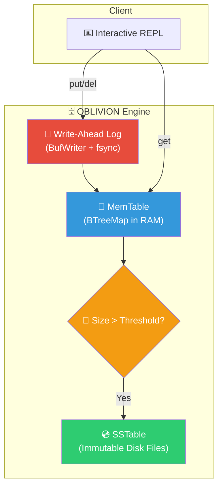

<div align="center">

```
   ██████╗ ██████╗ ██╗     ██╗██╗   ██╗██╗ ██████╗ ███╗   ██╗
  ██╔═══██╗██╔══██╗██║     ██║██║   ██║██║██╔═══██╗████╗  ██║
  ██║   ██║██████╔╝██║     ██║██║   ██║██║██║   ██║██╔██╗ ██║
  ██║   ██║██╔══██╗██║     ██║╚██╗ ██╔╝██║██║   ██║██║╚██╗██║
  ╚██████╔╝██████╔╝███████╗██║ ╚████╔╝ ██║╚██████╔╝██║ ╚████║
   ╚═════╝ ╚═════╝ ╚══════╝╚═╝  ╚═══╝  ╚═╝ ╚═════╝ ╚═╝  ╚═══╝
```

### 🗄️ System 13/300: LSM-Tree Key-Value Storage Engine

[](https://github.com/DaviBonetto/OBLIVION-L3-LSM-Storage-Engine/actions/workflows/ci.yml)
[](https://www.rust-lang.org/)
[](https://en.wikipedia.org/wiki/Log-structured_merge-tree)
[](https://en.wikipedia.org/wiki/NoSQL)
[](LICENSE)

**Crash-Recoverable Key-Value Store with WAL Durability**

---

[Quick Start](#-quick-start) • [Architecture](#-architecture) • [Usage](#-usage)

</div>

---

## 🚀 Quick Start

```bash
# Build
cargo build --release

# Run the interactive REPL
cargo run --release
```

---

## 🏗️ Architecture



---

## 📜 Usage

```
oblivion> set name Titan Protocol
  OK

oblivion> get name
  "Titan Protocol"

oblivion> del name
  OK (deleted)

oblivion> scan
  (empty)

oblivion> info
  Entries:       0
  MemTable size: 0 bytes
```

---

## 📁 Project Structure

```
src/
├── main.rs              # Interactive REPL CLI
├── config.rs            # Engine configuration
├── error.rs             # Custom error types (thiserror)
├── types.rs             # Key, Value, Entry definitions
└── engine/
    ├── mod.rs           # Core Oblivion engine (put/get/flush)
    ├── memtable.rs      # In-memory BTreeMap with tests
    ├── wal.rs           # Write-Ahead Log (BufWriter + CRC32)
    └── sstable.rs       # SSTable stub (future implementation)
```

---

## 🔧 Key Features

- **WAL Durability** — Every write is logged to disk before memory
- **CRC32 Integrity** — Checksums detect corruption during recovery
- **BufWriter Optimization** — Batched syscalls for write throughput
- **Tombstone Deletes** — LSM-correct deletion semantics
- **Crash Recovery** — Automatic WAL replay on startup
- **Sorted Iteration** — BTreeMap provides ordered scans

---

## 🔗 Titan Protocol Initiative

| System     | Name         | Technology     |
| ---------- | ------------ | -------------- |
| 08/300     | HERMES       | Go + gRPC      |
| 09/300     | CERBERUS     | Rust + Axum    |
| 12/300     | HYPERION     | Docker         |
| **13/300** | **OBLIVION** | **Rust + LSM** |

---

<div align="center">

**Built with 🦀 Rust by [Davi Bonetto](https://github.com/DaviBonetto)**

_Part of the Titan Protocol Initiative_

</div>
